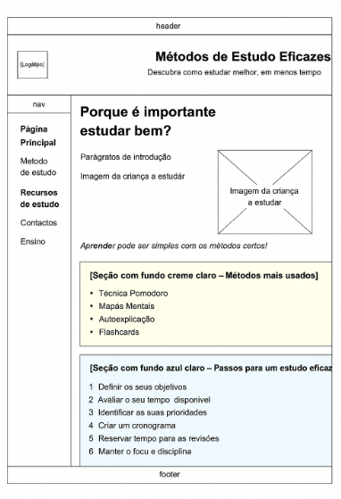

# Relatório Técnico – Métodos de Estudo Eficazes

**Grupo:** `inf24tig07-trabalho-final`  
**Repositório GitHub:** [https://github.com/inf24tig07-trabalho-final/trabalho-final](https://github.com/inf24tig07-trabalho-final/trabalho-final)

---

## 1. Apresentação do Projeto

### Tema: Ensino

### Proposta de Trabalho

O presente projeto tem como finalidade o desenvolvimento de um **website informativo e estático**, composto por pelo menos **quatro páginas**, subordinado ao tema “Ensino”. Para a sua concretização, foram utilizadas as tecnologias **HTML5**, **CSS3** e **JavaScript**.

O principal objetivo consistiu em disponibilizar conteúdos relevantes sobre métodos de estudo, recursos educativos, curiosidades e contactos, de forma clara, acessível e visualmente apelativa. Adicionalmente, procurou-se aplicar **boas práticas de semântica, acessibilidade, validação e usabilidade**.

### Descrição Geral

O website foi concebido para servir alunos, professores e qualquer utilizador interessado em aprofundar os seus conhecimentos sobre educação. As páginas estão interligadas através de um **menu de navegação responsivo** e acessível em todos os dispositivos.

As páginas desenvolvidas foram:

- `index.html` – Página inicial com introdução ao tema e navegação geral.
- `curiosidadesensino.html` – Curiosidades e factos interessantes sobre o ensino.
- `metodos.html` – Apresentação de métodos pedagógicos diversos.
- `recursos.html` – Recursos e ferramentas úteis para estudo.
- `contacto.html` – Formulário de contacto com validações.

O projeto respeitou os princípios da web estática, sem recurso a servidores ou bases de dados, utilizando **JavaScript para interatividade**, **CSS externo para estilos reutilizáveis** e **design responsivo**.

---

## 2. Interface com o Utilizador

### Sitemap

> O site apresenta uma estrutura simples, com um menu de navegação presente em todas as páginas, facilitando o acesso aos conteúdos.

---

## Wireframes

### Wireframe da Página Inicial

Este wireframe representa a estrutura da página inicial do website. O objetivo é apresentar o tema principal do projeto (“Ensino”) de forma clara e apelativa, orientando o utilizador para os restantes conteúdos através de um menu de navegação e destaques visuais. Inclui um cabeçalho com logótipo, secção introdutória e ligações rápidas para as restantes páginas.

---

### Wireframe da Página “Métodos de Ensino”

Este wireframe define a disposição da informação relativa às várias técnicas de ensino. O layout foi organizado em três colunas para facilitar a leitura comparativa e a exploração de diferentes métodos. Cada coluna inclui imagem, título e breve descrição da técnica, com foco na clareza visual e responsividade.

---

### Wireframe da Página “Recursos Educativos”

Este wireframe ilustra a estrutura da página dedicada à apresentação de recursos úteis para o estudo. O objetivo principal é fornecer ao utilizador uma lista organizada de ferramentas, plataformas, materiais digitais ou físicos que apoiem o processo de aprendizagem. O layout foi desenhado com blocos bem definidos, com títulos, ícones e descrições curtas para facilitar a navegação e a seleção dos recursos.

---

### Wireframe da Página de Contacto

Este wireframe descreve a estrutura da página de contacto. Está centrado num formulário simples e funcional, com campos para nome, email, seleção de métodos e uma área de mensagem. O design foca-se na acessibilidade e na validação dos campos de forma intuitiva. Inclui também informações de contacto adicionais.

---

### Wireframe da Página “Curiosidades sobre o Ensino”

Este wireframe corresponde à página onde são apresentadas curiosidades e factos interessantes relacionados com o mundo do ensino. Esta página visa despertar o interesse dos utilizadores com conteúdos informativos e inspiradores. O design prevê uma apresentação em formato de cartões ou secções destacadas, com imagens e texto, garantindo uma leitura leve e envolvente.

