# Relatório Técnico – Métodos de Estudo Eficazes
**Curso:** Informática 
**Unidade Curricular:** Tecnologias da Internet 
**Docente:** Marco Amaro Oliveira 
**Grupo:** inf24tig07-trabalho-final  
**Elementos do Grupo:** Daniel Pires, Helder Milagre
**Ano Letivo:** 2024/2025  
**Escola:** Universidade da Maia

**Grupo:** `inf24tig07-trabalho-final`  
**Repositório GitHub:** [https://github.com/inf24tig07-trabalho-final/trabalho-final](https://github.com/inf24tig07-trabalho-final/trabalho-final)

---

Índice

1. [Apresentação do Projeto](#1-apresentação-do-projeto)  
2. [Interface com o Utilizador](#2-interface-com-o-utilizador)  
   - [Sitemap](#sitemap)  
   - [Wireframes](#wireframes)  
   - [Comparação com o Resultado Final](#Comparação-entre-o-Estudo-Inicial-e-o-Produto-Final)  
3. [Produto](#3-produto)  
   - [Descrição do Produto](#descrição-do-produto)  
   - [Link para o Site](#link-para-o-site)  
   - [Instruções de Instalação](#instruções-de-instalação)  
   - [Regras de Utilização](#regras-de-utilização)  
   - [Ajuda à Navegação](#ajuda-à-navegação)  
   - [Validações de Formulários](#validações-de-formulários)  
   - [Validação do HTML e CSS](#validação-do-html-e-css)  
   - [Detalhes de Implementação](#detalhes-de-implementação)  
4. [Apresentação](#4-apresentação)

---

## 1. Apresentação do Projeto

### Tema: Ensino

### Proposta de Trabalho

O presente projeto tem como finalidade o desenvolvimento de um **website informativo e estático**, composto por pelo menos **quatro páginas**, subordinado ao tema “Ensino”. Para a sua concretização, foram utilizadas as tecnologias **HTML5**, **CSS3** e **JavaScript**.

O principal objetivo consistiu em disponibilizar conteúdos relevantes sobre métodos de estudo, recursos educativos, curiosidades e contactos, de forma clara, acessível e visualmente apelativa. Adicionalmente, procurou-se aplicar **boas práticas de semântica, acessibilidade, validação e usabilidade**.

### Descrição Geral

O website foi concebido para servir alunos, professores e qualquer utilizador interessado em aprofundar os seus conhecimentos sobre educação. As páginas estão interligadas através de um **menu de navegação responsivo** e acessível em todos os dispositivos.

As páginas desenvolvidas foram:

- `index.html` – Página inicial com introdução ao tema e navegação geral.
- `curiosidadesensino.html` – Curiosidades e factos interessantes sobre o ensino.
- `metodos.html` – Apresentação de métodos pedagógicos diversos.
- `recursos.html` – Recursos e ferramentas úteis para estudo.
- `contacto.html` – Formulário de contacto com validações.

O projeto respeitou os princípios da web estática, sem recurso a servidores ou bases de dados, utilizando **JavaScript para interatividade**, **CSS externo para estilos reutilizáveis** e **design responsivo**.

---

## 2. Interface com o Utilizador

### Sitemap

> O site apresenta uma estrutura simples, com um menu de navegação presente em todas as páginas, facilitando o acesso aos conteúdos.
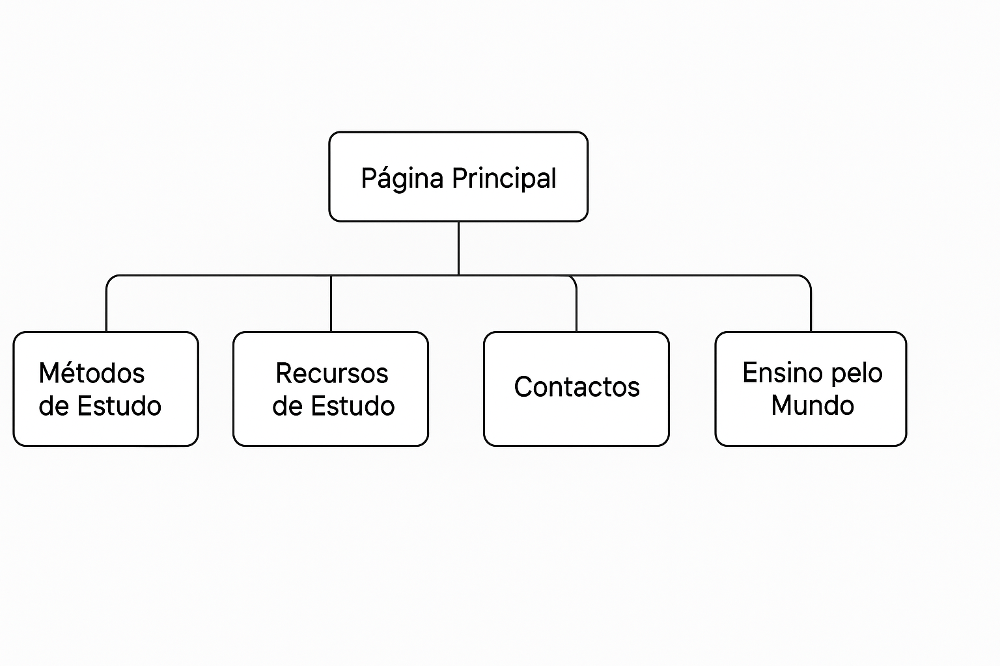

---

## Wireframes

### Wireframe da Página Inicial

Este wireframe representa a estrutura da página inicial do website. O objetivo é apresentar o tema principal do projeto (“Ensino”) de forma clara e apelativa, orientando o utilizador para os restantes conteúdos através de um menu de navegação e destaques visuais. Inclui um cabeçalho com logótipo, secção introdutória e ligações rápidas para as restantes páginas.

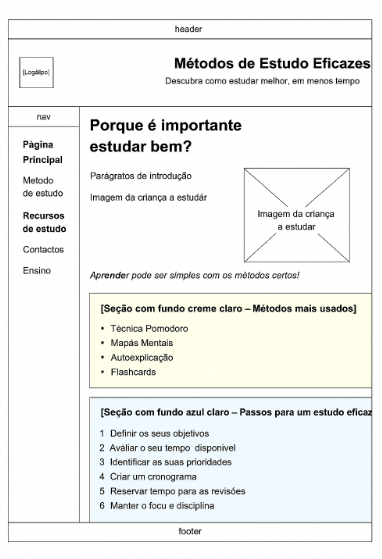

---

### Wireframe da Página “Métodos de Ensino”

Este wireframe define a disposição da informação relativa às várias técnicas de ensino. O layout foi organizado em três colunas para facilitar a leitura comparativa e a exploração de diferentes métodos. Cada coluna inclui imagem, título e breve descrição da técnica, com foco na clareza visual e responsividade.

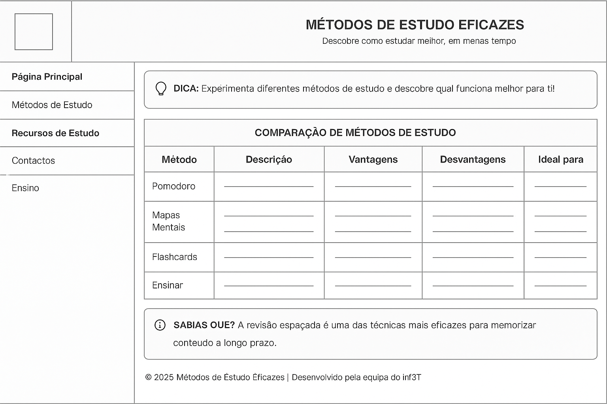

---

### Wireframe da Página “Recursos Educativos”

Este wireframe ilustra a estrutura da página dedicada à apresentação de recursos úteis para o estudo. O objetivo principal é fornecer ao utilizador uma lista organizada de ferramentas, plataformas, materiais digitais ou físicos que apoiem o processo de aprendizagem. O layout foi desenhado com blocos bem definidos, com títulos, ícones e descrições curtas para facilitar a navegação e a seleção dos recursos.

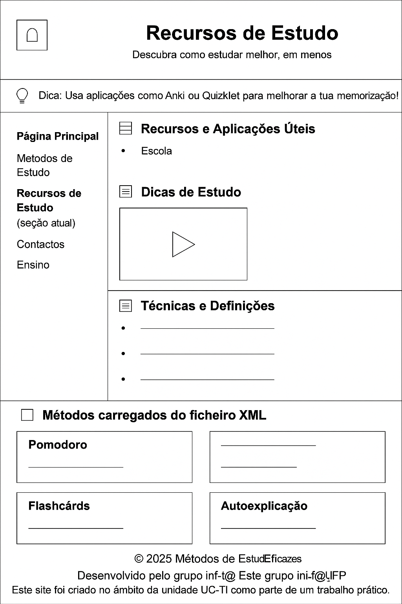

---

### Wireframe da Página de Contacto

Este wireframe descreve a estrutura da página de contacto. Está centrado num formulário simples e funcional, com campos para nome, email, seleção de métodos e uma área de mensagem. O design foca-se na acessibilidade e na validação dos campos de forma intuitiva. Inclui também informações de contacto adicionais.

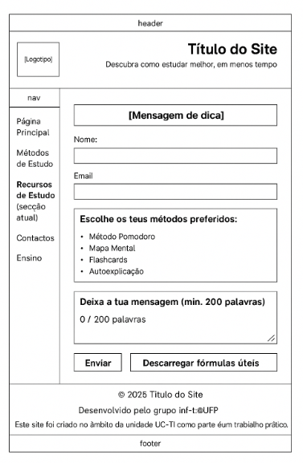

---

### Wireframe da Página “Curiosidades sobre o Ensino”

Este wireframe corresponde à página onde são apresentadas curiosidades e factos interessantes relacionados com o mundo do ensino. Esta página visa despertar o interesse dos utilizadores com conteúdos informativos e inspiradores. O design prevê uma apresentação em formato de cartões ou secções destacadas, com imagens e texto, garantindo uma leitura leve e envolvente.

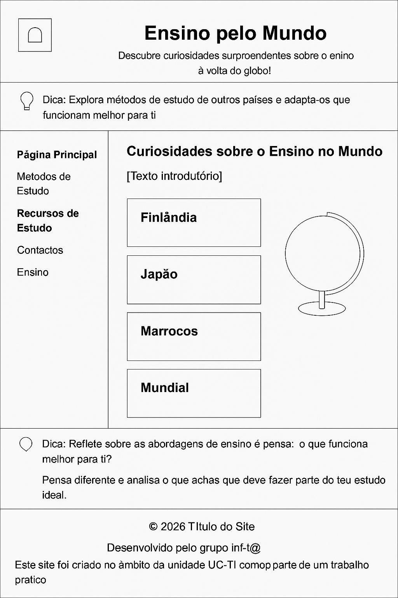

---
### Comparação entre o Estudo Inicial e o Produto Final.

Todos os wireframes desenvolvidos foram respeitados na implementação do website. As páginas finais correspondem integralmente à estrutura prevista, tanto a nível de conteúdo como de organização visual.

| Página                | Cumprimento do Planeamento | Observações                                                                 |
|----------------------|-----------------------------|------------------------------------------------------------------------------|
| Página Inicial       | ✅ Sim                      | Seguiu exatamente o layout com introdução, métodos usados e passos para estudar bem. |
| Métodos de Estudo    | ✅ Sim                      | A tabela comparativa foi fiel ao wireframe com as 5 colunas.                |
| Recursos de Estudo   | ✅ Sim                      | A divisão por secções (recursos, vídeo, definições, XML) foi mantida.       |
| Contacto             | ✅ Sim                      | Todos os elementos do formulário e botões foram incluídos como planeado.    |
| Curiosidades/Ensino  | ⚠️ Parcialmente             | A estrutura visual está conforme o wireframe, mas os países apresentados diferem dos inicialmente planeados. |
| Menu de Navegação    | ✅ Sim                      | Consistência assegurada em todas as páginas.                                |

A navegação é intuitiva e coerente em todas as páginas, e os estilos aplicados garantem uma experiência de utilizador semelhante à que foi desenhada na fase de prototipagem.

Além disso, o sitemap manteve-se inalterado, confirmando que o produto final respeitou a hierarquia e o planeamento inicial do projeto.

---

## 3. Produto

### Descrição do Produto

O site apresenta diversas técnicas de estudo com explicações visuais, imagens ilustrativas e uma navegação simples. O conteúdo foi escrito de forma direta e objetiva, com base em fontes confiáveis.

### Link para o Site

🔗 [Acede aqui ao site publicado no Netlify](https://elegant-pixie-eabc57.netlify.app)

### Instruções de Instalação

#### Instalação Local

1. Clonar o repositório:
   
bash
   git clone https://github.com/inf24tig07-trabalho-final/trabalho-final.git#### ✔️ Instalação no Netlify (Publicação Automática) 

1. Cria uma conta gratuita em [https://www.netlify.com](https://www.netlify.com)

2. Liga a tua conta do Netlify ao GitHub.

3. Escolhe o repositório `inf24tig07-trabalho-final/trabalho-final`.

4. Configura a publicação automática com os seguintes parâmetros:

   - **Build command**: *(deixar vazio – o projeto é estático)*
   - **Publish directory**: `/`

5. Clica em **Deploy**.

6. Após a publicação, copia o link gerado para acesso público ao site.

---

#### Regras de Utilização

- O site é **público** e **gratuito**.
- Não exige qualquer tipo de login ou autenticação.
- Não recolhe nem guarda dados pessoais dos utilizadores.

---

#### Ajuda a navegação

- A navegação é feita através de um **menu lateral fixo**, disponível em todas as páginas.
- Os seguintes itens estão sempre acessíveis:
  - Página Principal
  - Métodos de Estudo
  - Recursos de Estudo
  - Contactos
  - Ensino

#### Elementos visuais de apoio incluídos:

- Tooltips nos botões e ícones.
- Cores diferenciadas por tipo de conteúdo (ex: azul para passos, creme para métodos).
- Estrutura clara com títulos, listas e tabelas organizadas.
- Secção ativa destacada no menu.

---

### Validações dos Formulários

O formulário de contacto inclui:

- Campo de texto para **Nome**
- Campo de **Email** (com validação automática do tipo email)
- Caixa de seleção de **métodos preferidos**
- Área de texto limitada a **200 palavras**, com **contador dinâmico**
- Botões de **"Enviar"** e **"Descarregar fórmulas úteis"**

Validações JavaScript implementadas:

- Verificação de campos obrigatórios preenchidos
- Validação do formato de email
- Contador e limite de palavras para a textarea

---

### Validação HTML E CSS

#### Ferramentas utilizadas:

- [HTML Validator – W3C](https://validator.w3.org)
- [CSS Validator – W3C](https://jigsaw.w3.org/css-validator)

#### Resultados

- Todos os ficheiros HTML e CSS foram validados com sucesso, **sem erros**.
- Foram corrigidos pequenos *warnings* relacionados com boas práticas semânticas.

#### Capturas de ecrã da validação HTML:

- 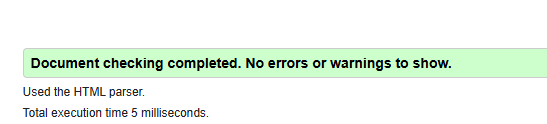
- 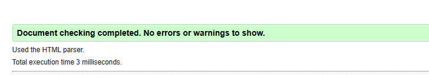
- 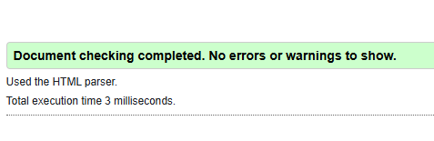
- 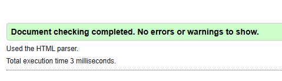
- 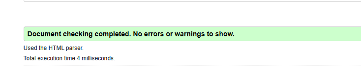

---

#### Detalhes de Implementação

O site cumpre todos os requisitos mínimos do enunciado. Cada página foi desenvolvida com:

- Estrutura semântica **HTML**
- Estilos externos **CSS** organizados e reutilizáveis
- Scripts em **JavaScript** para interatividade
- **Design responsivo** e compatível com diferentes ecrãs
- Conteúdo separado em **secções bem definidas**
- Foco na **legibilidade e usabilidade**
- Publicação online realizada com sucesso através da integração **GitHub + Netlify** eu quero que mudes o nome para  inf24tig07-trabalho final e o nome para  inf24tig07-trabalho-final / 
trabalho-final

---

## 4. Apresentação 
[Apresentação Final (PowerPoint)](apresentacao/Apresentacao_Final.pptx)
